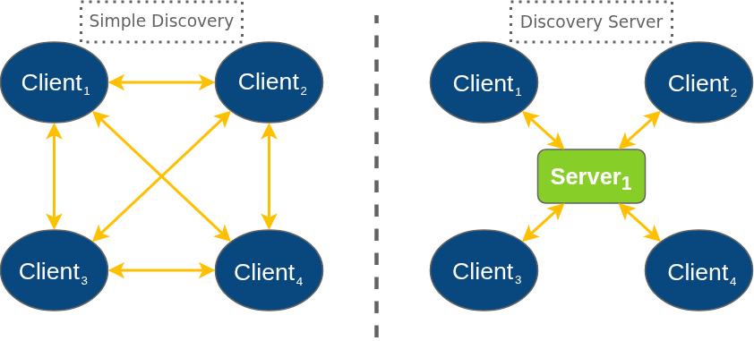

- [概念部分](#概念部分)
  - [DDS是什么](#dds是什么)
  - [DDS中的核心术语](#dds中的核心术语)
    - [DomainParticipant](#domainparticipant)
    - [Publisher / Subscriber](#publisher--subscriber)
    - [DataWriter / DataReader](#datawriter--datareader)
    - [QoS](#qos)
      - [topic一致性检查](#topic一致性检查)
      - [端点匹配](#端点匹配)
    - [Participant Discovery Phase（PDP，参与者发现阶段）](#participant-discovery-phasepdp参与者发现阶段)
    - [Endpoint Discovery Phase（EDP，端点发现阶段）](#endpoint-discovery-phaseedp端点发现阶段)
  - [FastDDS 通信流程](#fastdds-通信流程)
    - [参与者初始化](#参与者初始化)
    - [类型注册](#类型注册)
    - [发布者和订阅者创建阶段](#发布者和订阅者创建阶段)
    - [发现阶段](#发现阶段)
    - [数据传输](#数据传输)
    - [资源释放与终止](#资源释放与终止)
- [实操部分](#实操部分)
  - [FastDDS安装](#fastdds安装)
  - [HelloWorld示例](#helloworld示例)
    - [创建工作空间](#创建工作空间)
    - [配置CMake](#配置cmake)
    - [构建话题数据类型](#构建话题数据类型)
      - [编写 IDL 文件](#编写-idl-文件)
      - [使用 Fast DDS-Gen 为自定义主题生成 C++ 定义](#使用-fast-dds-gen-为自定义主题生成-c-定义)
    - [编写发布者与订阅者](#编写发布者与订阅者)
      - [修改CMakeLists.txt](#修改cmakeliststxt)
    - [demo运行](#demo运行)
  - [与ROS2通信示例1——ROS2内发布，外部Fast DDS订阅](#与ros2通信示例1ros2内发布外部fast-dds订阅)
    - [编写ROS2端发布者](#编写ros2端发布者)
    - [编写Fast DDS端订阅者](#编写fast-dds端订阅者)
    - [示例1运行结果](#示例1运行结果)
  - [与ROS2通信示例2——外部Fast DDS发布，ROS2内订阅](#与ros2通信示例2外部fast-dds发布ros2内订阅)
    - [编写ROS2端订阅者](#编写ros2端订阅者)
    - [编写Fast DDS端发布者](#编写fast-dds端发布者)
    - [示例2运行结果](#示例2运行结果)
- [注意事项](#注意事项)


# 概念部分

## DDS是什么

- 数据分发服务（Data Distribution Service，DDS）是一种 发布-订阅（Pub/Sub）通信中间件标准。
- 基于 DCPS（Data-Centric Publish Subscribe）模型，实现应用层上发布订阅机制、QoS管理等功能。
- 基于 RTPS（Real-Time Publish Subscribe）协议实现传输层上节点发现、实体匹配、可靠传输、实时传输等功能。
- 它是去中心化、实时可靠、低延迟、高吞吐的通信中间件。


DCPS模型实体（提供面向开发者的抽象接口）


RTPS协议模型（实际执行功能）

[DDS是什么--官方文档](https://fast-dds.docs.eprosima.com/en/latest/fastdds/getting_started/definitions.html)

## DDS中的核心术语

| 名称                        | 作用                               |
| --------------------------- | ---------------------------------- |
| **DomainParticipant**       | 表示一个应用实例，DDS 的起点       |
| **Publisher / Subscriber**  | 发布者 / 订阅者容器                |
| **DataWriter / DataReader** | 实际的数据写入者 / 读取者          |
| **Topic**                   | 表示某类数据的通道（有名称、类型） |
| **QoS（质量服务）**         | 控制传输的可靠性、历史性、持续性等 |
| **TypeSupport / IDL**       | 定义传输的数据结构                 |
| **PDP / EDP**               | 参与者和发现协议（自动发现机制）   |


实体层次结构如下图所示：


### DomainParticipant

DDS 网络通信的入口点，一个节点加入 DDS 网络后必须先创建它

作用：
- 加入某个 Domain ID
- 创建和管理 Publisher、Subscriber、Topic
- 注册消息类型
- 设置全局 QoS（网络发现机制， 传输类型等）

### Publisher / Subscriber

代表发送方和接收方的容器，用于逻辑组织 DataWriter/DataReader

作用：
- 设置对数据发送/接收的 QoS 策略
- 承载一个或多个 DataWriter/DataReader

### DataWriter / DataReader

真正执行数据传输的“工作单元”

作用：
- DataWriter 向某个 Topic 发送数据
- DataReader 从某个 Topic 接收数据
- 每个 DataWriter/Reader 必须绑定到一个具体的 Topic

### QoS
| Qos策略              | ROS2默认值 | FastDDS中Datareader | FastDDS中Datawriter默认值 |
| -------------------- | ---------- | ------------------- | ------------------------- |
| 可靠性 (Reliability) | RELIABLE   | BEST_EFFORT         | RELIABLE                  |
| 持久性 (Durability)  | VOLATILE   | VOLATILE            | TRANSIENT_LOCAL           |
| 历史记录 (History)   | KEEP_LAST  | KEEP_LAST           | KEEP_LAST                 |
| 深度 (Depth)         | 10         | 1                   | 1                         |

FastDDS中默认配置可见`usr/local/include/fastdds/dds/core/policy/QoSPolicies.hpp`

#### topic一致性检查

首先匹配topic的QoS，要保证在同一个 DDS 域中，所有参与者对同一个 Topic 的定义必须是兼容的

对于持久性的兼容要求是，新创建的 Topic 的 Durability 等级必须小于或等于 (<=) 网络中已存在的 Topic 的 Durability 等级。

VOLATILE < TRANSIENT_LOCAL < TRANSIENT < PERSISTENT

#### 端点匹配

发布者的 DataWriter 需要与订阅者的 DataReader 进行匹配。两者完全相等时，匹配成功。

在与ROS2通信时，ROS2的发布者/订阅者与FastDDS的DataReader/DataWriter进行匹配

### Participant Discovery Phase（PDP，参与者发现阶段）

在该阶段，DomainParticipant（域参与者）会相互确认彼此的存在。为此，每个 DomainParticipant 会周期性地发送公告消息（announcement messages），这些消息中包含了该参与者用于接收元数据和用户数据流量的单播地址（IP 和端口）等信息。

当两个 DomainParticipant 处于同一个 DDS 域（Domain）时，它们才能匹配成功。默认情况下，这些公告消息会通过众所周知的多播地址和端口（根据 DomainId 计算得出）进行发送。此外，也可以指定一组地址，通过单播方式发送公告。同时，还可以配置这些公告消息的发送周期。

### Endpoint Discovery Phase（EDP，端点发现阶段）

在该阶段，DataWriter 和 DataReader 会相互确认彼此的存在。为此，DomainParticipant 会通过在 PDP 阶段建立的通信通道，互相共享其 DataWriter 和 DataReader 的信息。这些信息包括但不限于 Topic 和数据类型。只有当两个端点的 Topic 和数据类型兼容时，才能匹配成功。一旦 DataWriter 和 DataReader 匹配完成，即可开始进行用户数据的发送和接收。


## FastDDS 通信流程

| 阶段            | 主要内容                    |
| --------------- | --------------------------- |
| 1. 参与者初始化 | 创建 DomainParticipant      |
| 2. 类型注册     | 注册 Topic 和 Type          |
| 3. 发布者和订阅者创建   | 创建 Publisher / Subscriber |
| 4. 发现         | 发现其他参与者和写读器      |
| 5. 数据传输     | 实际的数据发送与接收        |
| 6. 资源释放与终止    | 销毁资源                    |


### 参与者初始化

- 创建并初始化 DomainParticipant
- 加载并应用 QoS 策略（如 discovery 配置、资源限制等）

### 类型注册

- 通过TypeSupport注册自定义消息类型
- 创建 Topic，并与类型绑定

### 发布者和订阅者创建阶段

- 创建 Publisher/Subscriber 实体
- 配置并绑定 DataWriter/DataReader
- 设置 QoS

### 发现阶段

默认采用简单发现(Simple Discovery)机制
- 支持 PDP 和 EDP 的 RTPS 标准，与其他 DDS 和 RTPS 兼容
- 通过 PDP 发现其他 DomainParticipant
- 通过 EDP 发现 DataWriter 和 DataReader
- 匹配 Topic、Type 和 QoS 参数

对于复杂系统可以使用发现服务器(Discovery Server)机制，使用集中式发现架构，提高效率


### 数据传输

- DataWriter 发送数据到网络（unicast 或 multicast）
- DataReader 接收并缓存数据，根据 QoS 进行处理

### 资源释放与终止

- 删除 DataWriter/DataReader
- 删除 Publisher/Subscriber
- 删除 DomainParticipant

# 实操部分

## FastDDS安装

[以二进制文件安装](https://fast-dds.docs.eprosima.com/en/latest/installation/binaries/binaries_linux.html)（快速，简单）

[以源码安装](https://fast-dds.docs.eprosima.com/en/latest/installation/sources/sources_linux.html)（可以使用colcon代替cmake编译）


## HelloWorld示例

### 创建工作空间

项目结束时，工作空间将具有以下结构:
```
.
└── workspace_DDSHelloWorld
    ├── build
    │   ├── CMakeCache.txt
    │   ├── CMakeFiles
    │   ├── cmake_install.cmake
    │   ├── DDSHelloWorldPublisher
    │   ├── DDSHelloWorldSubscriber
    │   └── Makefile
    ├── CMakeLists.txt
    └── src
        ├── HelloWorld.hpp
        ├── HelloWorld.idl
        ├── HelloWorldCdrAux.hpp
        ├── HelloWorldCdrAux.ipp
        ├── HelloWorldPublisher.cpp
        ├── HelloWorldPubSubTypes.cxx
        ├── HelloWorldPubSubTypes.h
        ├── HelloWorldSubscriber.cpp
        ├── HelloWorldTypeObjectSupport.cxx
        └── HelloWorldTypeObjectSupport.hpp
```

### 配置CMake

```cmake
cmake_minimum_required(VERSION 3.20)

project(DDSHelloWorld)

# Find requirements
if(NOT fastcdr_FOUND)
    find_package(fastcdr 2 REQUIRED)
endif()

if(NOT fastdds_FOUND)
    find_package(fastdds 3 REQUIRED)
endif()

# Set C++11
include(CheckCXXCompilerFlag)
if(CMAKE_COMPILER_IS_GNUCXX OR CMAKE_COMPILER_IS_CLANG OR
        CMAKE_CXX_COMPILER_ID MATCHES "Clang")
    check_cxx_compiler_flag(-std=c++11 SUPPORTS_CXX11)
    if(SUPPORTS_CXX11)
        add_compile_options(-std=c++11)
    else()
        message(FATAL_ERROR "Compiler doesn't support C++11")
    endif()
endif()

message(STATUS "Configuring HelloWorld publisher/subscriber example...")
file(GLOB DDS_HELLOWORLD_SOURCES_CXX "src/*.cxx")
```

### 构建话题数据类型

#### 编写 IDL 文件
```cpp
/**
 * @file HelloWorld.idl
 */
struct HelloWorld
{
    unsigned long index;
    string message;
};
```

#### 使用 Fast DDS-Gen 为自定义主题生成 C++ 定义

**Fast DDS-Gen**是一个专用的生成工具，用于将类型描述（IDL文件）转换为合适的实现，以填补接口和中间件之间的空白

在`src`目录下运行命令，生成源代码
`<path/to/Fast DDS-Gen>/scripts/fastddsgen HelloWorld.idl`


### 编写发布者与订阅者

源码见`HelloWorldPublisher.cpp`与`HelloWorldSubscriber.cpp`

#### 修改CMakeLists.txt

添加
```cmake
add_executable(DDSHelloWorldPublisher src/HelloWorldPublisher.cpp ${DDS_HELLOWORLD_SOURCES_CXX})
target_link_libraries(DDSHelloWorldPublisher fastdds fastcdr)

add_executable(DDSHelloWorldSubscriber src/HelloWorldSubscriber.cpp ${DDS_HELLOWORLD_SOURCES_CXX})
target_link_libraries(DDSHelloWorldSubscriber fastdds fastcdr)
```

### demo运行

在`build`目录下进行构建，编译与运行


## 与ROS2通信示例1——ROS2内发布，外部Fast DDS订阅

使用ROS2内置`std_msgs::msg::String`数据类型，话题名称为`chatter`,默认Qos设置即适配，域ID默认为0

### 编写ROS2端发布者

默认配置的发布者

### 编写Fast DDS端订阅者

1. 创建工作空间(src,build)
2. 配置CMake(CMakeLists.txt)
3. 构建话题数据类型(xxx.idl)
   1. 复制`/opt/ros/humble/share/std_msgs/msg/`中的ROS2官方IDL文件作为自己的IDL文件
   2. 添加`dds_`命名空间，确保类型相符
   3. `fastddsgen xxx.idl`将描述文件转换为实现
4. 编写代码
   1. 话题名前添加前缀`rt/`
   2. 类型使用`std_msgs::msg::dds_::String_`(或通过`type_.get_type_name()`自动获取)

部分关键代码：
```cpp
/**
 * @file String.idl
 */
module std_msgs {
  module msg {
    module dds_ {
      struct String_ {
        string data;
      };
    };
  };
};
```

```cpp
    ...

    DomainParticipantQos participantQos;
    participantQos.name("Participant_subscriber");
    participant_ = DomainParticipantFactory::get_instance()->create_participant(
        0, participantQos);

    ...
    // Create the subscriptions Topic
    topic_ = participant_->create_topic("rt/chatter", type_.get_type_name(),
                                      TOPIC_QOS_DEFAULT);
```

### 示例1运行结果


## 与ROS2通信示例2——外部Fast DDS发布，ROS2内订阅

使用ROS2内置`std_msgs::msg::String`数据类型，话题名称为`chatter`,默认Qos设置即适配，域ID默认为0

### 编写ROS2端订阅者

默认配置的订阅者

### 编写Fast DDS端发布者

步骤与示例1相同

部分关键代码：
```cpp
    ...

    // 初始化
    DomainParticipantQos participantQos;
    participantQos.name("Participant_publisher");
    participant_ = DomainParticipantFactory::get_instance()->create_participant(
        0, participantQos);
    
    ...

    // 创建发布的话题
    topic_ = participant_->create_topic(
        "rt/chatter", "std_msgs::msg::dds_::String_", TOPIC_QOS_DEFAULT);
```

### 示例2运行结果


# 注意事项

在将 ROS2 节点与原生 Fast DDS 程序进行通信时，需注意以下几点：
- `.idl`类型要保持一致
  - 原生 Fast DDS 需要在 ROS2 标准类型上添加`dds_`命名空间和在类型名后添加下划线`_`
- 话题(Topic)名称保持一致
  - 原生 Fast DDS 需要在话题前添加`rt/`,代表`ros topic`
- QoS需要兼容
  - DataWriter与DataReader需要按要求兼容
  - 对于Topic持久性的兼容要求是，新创建的 Topic 的 Durability 等级必须小于或等于 (<=) 网络中已存在的 Topic 的 Durability 等级
    - `VOLATILE` < `TRANSIENT_LOCAL` < `TRANSIENT` < `PERSISTENT`

QoS兼容表格如下：

| QoS 策略                 | DataWriter 设置     | DataReader 设置     | 是否兼容 | 匹配规则说明                              |
| ---------------------- | ----------------- | ----------------- | ---- | ----------------------------------- |
| **Reliability**<br>可靠性 | `BEST_EFFORT`     | `BEST_EFFORT`     | ✅    | 完全匹配                                |
|                        | `RELIABLE`        | `BEST_EFFORT`     | ✅    | Writer ≥ Reader；Reader 可接受更弱 Writer |
|                        | `BEST_EFFORT`     | `RELIABLE`        | ❌    | Reader 要求可靠，Writer 无法保证             |
|                        | `RELIABLE`        | `RELIABLE`        | ✅    | 完全匹配                                |
| **Durability**<br>持久性  | `VOLATILE`        | `VOLATILE`        | ✅    | 完全匹配                                |
|                        | `TRANSIENT_LOCAL` | `VOLATILE`        | ✅    | Reader 能接受更强 Durability             |
|                        | `VOLATILE`        | `TRANSIENT_LOCAL` | ❌    | Reader 要求接收历史数据，Writer 不提供          |
|                        | `TRANSIENT_LOCAL` | `TRANSIENT_LOCAL` | ✅    | 完全匹配                                |
| **History**<br>历史策略    | `KEEP_LAST(10)`   | `KEEP_LAST(5)`    | ✅    | Writer 保留更多历史，Reader 可以接受较少         |
|                        | `KEEP_LAST(5)`    | `KEEP_LAST(10)`   | ❌    | Reader 要求更多历史，但 Writer 没有           |
|                        | `KEEP_ALL`        | `KEEP_ALL`        | ✅    | 完全匹配                                |
| **Deadline**           | `10ms`            | `20ms`            | ✅    | Writer 频率 ≥ Reader 要求               |
|                        | `20ms`            | `10ms`            | ❌    | Writer 更新不够频繁                       |
| **Liveliness**         | `AUTOMATIC`       | `AUTOMATIC`       | ✅    | 完全匹配                                |
|                        | `MANUAL_BY_TOPIC` | `AUTOMATIC`       | ✅    | Writer 要求更强                         |
|                        | `AUTOMATIC`       | `MANUAL_BY_TOPIC` | ❌    | Reader 需要手动声明活跃性，Writer 不支持         |
| **Ownership**          | `SHARED`          | `SHARED`          | ✅    | 完全匹配                                |
|                        | `EXCLUSIVE`       | `SHARED`          | ✅    | Reader 可接受更强                        |
|                        | `SHARED`          | `EXCLUSIVE`       | ❌    | Reader 要求排他式控制                      |

  